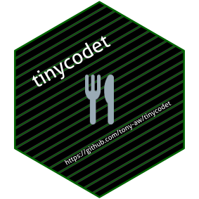

<!-- README.md is generated from README.Rmd. Please edit that file -->

# tinycodet <a href="https://github.com/tony-aw/tinycodet/"></a>

<!-- badges: start -->

[](https://github.com/tony-aw/tinycodet/actions)
[](https://www.repostatus.org/#active)
[](https://lifecycle.r-lib.org/articles/stages.html#stable)
[](https://orcid.org/0000-0001-9498-8379)
[](https://tony-aw.github.io/tinycodet/)
[](https://cran.r-project.org/package=tinycodet)
[](https://cran.r-project.org/package=tinycodet)
<!-- badges: end -->

 

## Overview

‘tinycodet’ adds some functions to help in your coding etiquette. It
primarily focuses on 4 aspects:

1)  Safer decimal (in)equality testing, standard-evaluated alternatives
    to `with()` and `aes()`, and other functions for safer coding.
2)  A new package import system, that attempts to combine the benefits
    of using a package without attaching, with the benefits of attaching
    a package.
3)  Extending the string manipulation capabilities of the ‘stringi’ R
    package.
4)  Reducing repetitive code.

‘tinycodet’ adheres to the [tinyverse](https://www.tinyverse.org/)
philosophy (not to be confused with the tidyverse). Besides linking to
‘Rcpp’, ‘tinycodet’ has only one other dependency: ‘stringi’. No other
dependencies, thus avoiding “dependency hell”. Most functions in this
R-package are vectorized and optimised.

Although this is a relatively small R package, I do understand you may
not want to go through all the articles and help files of ‘tinycodet’
without knowing if the R package is even worth your time. Therefore, to
get a quick glimpse of what ‘tinycodet’ provides, I humbly invite you to
take a look at the [Get
Started](https://tony-aw.github.io/tinycodet/articles/tinycodet.html)
page on the website (<https://tony-aw.github.io/tinycodet/>).

 

## Installation

One can install ‘tinycodet’ from CRAN like so:

``` r
install.packages("tinycodet")
```

Or get the development version from GitHub like so:

``` r
remotes::install_github("https://github.com/tony-aw/tinycodet")
```

And attach the package - thus exposing its functions to the namespace -
using:

``` r
library(tinycodet)
```

And one can open the introduction help page of the ‘tinycodet’ package
using any of the following:

``` r
?tinycodet::tinycodet
?tinycodet::`tinycodet-package`
?tinycodet::tinycodet_help
```

 

## Reporting issues and giving suggestions

When you coming across an issue with the ‘tinycodet’ R package, please
report it in the “Issues” tab on the GitHub page
(<https://github.com/tony-aw/tinycodet/issues>). If relevant, please
provide reproducible R code, as that will make it easier to diagnose the
issue. Please keep issue reports polite, professional, and to the point.

 

If you have questions or ideas, please submit them in the “Discussion”
tab on the GitHub page
(<https://github.com/tony-aw/tinycodet/discussions>).

 
