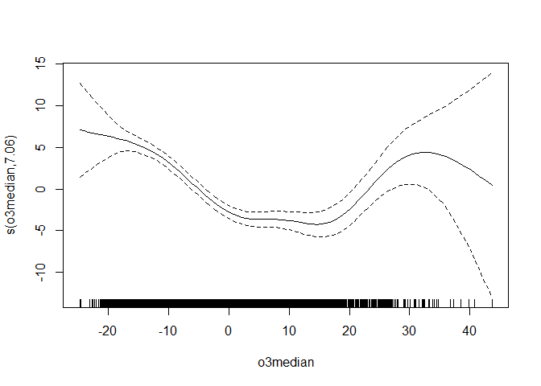

- [1 Introduction](#1-introduction)
- [2 import_as](#2-import_as)
- [3 import_inops and pkg_lsf](#3-import_inops-and-pkg_lsf)
- [4 import_data](#4-import_data)
- [5 Miscellaneous comments on package
  imports](#5-miscellaneous-comments-on-package-imports)
- [6 Sourcing modules](#6-sourcing-modules)
- [7 Regarding S3 methods](#7-regarding-s3-methods)
- [8 An example](#8-an-example)
- [9 Library handling the tinyverse
  way](#9-library-handling-the-tinyverse-way)
- [10 Compatibility with other R
  packages](#10-compatibility-with-other-r-packages)

<!-- README.md is generated from README.Rmd. Please edit that file -->

# 1 Introduction

One can load a package without attaching the package (i.e. using `::` or
using a package alias), or one can attach a package (i.e. using
`library` or `require()`). Both options have their pros and cons.

The benefits of loading a package using `::` or an alias, instead of
attaching the package, are as follows:

1)  prevent overlapping namespaces / masking functions.
2)  prevent overriding core R functions.
3)  clarify which function came from which package.
4)  exposing functions from a package only in the current environment
    (like only within a function environment), instead of attaching the
    functions globally to the namespace.
5)  prevent polluting the namespace (the more packages that are
    attached, the higher chance of masking functions, and the more
    difficult to de-bug your code).

The advantages of attaching a package instead of loading without
attaching are as follows:

1)  Less typing: You have to type less to use functions. This is
    particularly relevant for **infix operators**, as operators use
    special characters, which require them to be surrounded by
    back-ticks when using `::` or `alias$`.
2)  More collective usage: If multiple packages are meant to work
    together, constantly switching between the different package
    name/alias -prefixes may eventually become annoying and even
    syntactically chaotic.

Summarized in a table, the advantages and disadvantages of each approach
are as follows:

    #> 
    #> 
    #> |aspect                                        |alias / :: |attaching |
    #> |:---------------------------------------------|:----------|:---------|
    #> |prevent masking                               |Yes (+)    |No (-)    |
    #> |prevent override core R functions             |Yes (+)    |No (-)    |
    #> |clarify package origin of functions           |Yes (+)    |No (-)    |
    #> |expose functions only in current environment  |Yes (+)    |No (-)    |
    #> |prevent namespace pollution                   |Yes (+)    |No (-)    |
    #> |minimize typing (especially for operators)    |No (-)     |Yes (+)   |
    #> |use package collection syntactically coherent |No (-)     |Yes (+)   |
    #> |NOTE: + = advantage, - = disavantage          |           |          |

What `tinyoperations` attempts to do with its import system, is to
somewhat find the best of both worlds. Basically, `tinyoperations` has
functions that allow the following import functionality lacking in base
R:

- Allow package + its dependencies + its enhances + its extensions to be
  loaded under **one alias**. This essentially combines the attaching
  advantage of “collective usage”, whilst keeping most advantages of
  aliasing a package.
- Allow **exposing infix operators** to the **current environment**.
  This gains the attaching advantage of “less typing”, whilst
  simultaneously avoiding the disadvantage of attaching functions from a
  package globally.

Moreover, `tinyoperations` extends this functionality to also work on
**sourced modules**.

Just to clarify: I am not claiming this import system provided in the
`tinyoperations` package is always the best system or whatever. This is
just another option provided, just like the `import` and `box` packages
provide their own alternative import systems. Please feel free to
completely ignore this section if you’re really adamant on attaching
packages using `library()`/`require()` :-)

This section of the Read-Me is rather lengthy, so I will start with a
super quick example code using `tinyoperations`’s import system:

``` r
import_as( # loading "tidytable" + its foreign exports + "data.table" under alias "tdt." 
  tdt., "tidytable", dependencies = "data.table"
)
#> Importing packages...
#> 
#> Done
#> You can now access the functions using `tdt.$`.
#> (S3)methods will work like normally. 
#> For conflicts report and package order, see `attributes(tdt.)`.
attributes(tdt.)$conflicts |> knitr::kable()
```

| package                     | winning_conflicts                                                                                      |
|:----------------------------|:-------------------------------------------------------------------------------------------------------|
| data.table                  |                                                                                                        |
| tidytable + foreign exports | last, fread, first, between, %chin%, %like%, setDTthreads, data.table, getDTthreads, fwrite, %between% |

``` r

import_inops("magrittr") # exposing operators from `magrrittr` to current env
#> Getting infix operators from package: magrittr...
#> 
#> Checking for conflicting infix operators in the current environment...
#> Placing infix operators in current environment...
#> Done

d <- import_data("starwars", "dplyr") # directly assigning the "starwars" dataset to object "d"

d %>% tdt.$filter(species == "Droid") %>%
  tdt.$select(name, tdt.$ends_with("color"))
#> # A tidytable: 6 × 4
#>   name   hair_color skin_color  eye_color
#>   <chr>  <chr>      <chr>       <chr>    
#> 1 C-3PO  <NA>       gold        yellow   
#> 2 R2-D2  <NA>       white, blue red      
#> 3 R5-D4  <NA>       white, red  red      
#> 4 IG-88  none       metal       red      
#> 5 R4-P17 none       silver, red red, blue
#> 6 BB8    none       none        black

myalias. %@source% list(file="sourcetest.R") # source a script under an alias
#> Importing module ...
#> Done
#> You can now access the sourced objects using `myalias.$`.
myalias.$helloworld() # run a function that was just sourced.
#> [1] "hello world"

rm(list=ls()) # clearing everything
```

The above code is run *without* attaching `tidytable`, `data.table`,
`magrtittr`, or its dependencies. So none of the problems with attaching
a package is present.

What follows are descriptions of the functions that together form this
new, infix-operator friendly **&** multi-package assignment friendly,
import management system.

 

# 2 import_as

One can load a package without attaching it, and assign it to an alias,
in base R, using, for example:

``` r
alias <- loadNamespace("packagename", lib.loc = lib.loc)
```

Doing the above, instead of attaching a package using `library()` or
`require()`, can (often) be quite beneficial for several reasons.
i.e. prevent overlapping namespaces, prevent overriding core R
functions, prevent polluting the namespace, clarify which function came
from which package, exposing functions from a package only in the
current environment e to be loaded locally , etc.

Loading a package alias does have some drawbacks. One is that you cannot
easily import multiple packages under the same alias. While one probably
wouldn’t want to import **multiple** packages under a **single alias**
most of the time, there may be a couple of situations where importing
multiple packages into a single alias may be actually preferable:

- If multiple packages are meant to work together, constantly switching
  between the different package name/alias prefixes may eventually
  become annoying and even syntactically chaotic-looking.
- A package may have one or several dependencies that are supposed to be
  loaded together. For example: the `tidytable` package essentially
  needs the `data.table` package to be loaded also.
- A package may have many extensions you may want to load together. For
  example: `ggplot2` has many extensions (see
  <https://exts.ggplot2.tidyverse.org/gallery/>). If one wishes to alias
  `ggplot2` including some of its many extensions, it would be nice to
  load multiple R packages under the same alias.
- Suppose package `B` is supposed to overwrite a couple of functions
  from package `A` (for example if package `B` extends or improves the
  functionality from a function in package `A`). In that case you may
  want to import package `A`, and then overwrite it with package `B`.

So there are several cases where it is perhaps desirable to load
multiple packages under the same alias.

And that is where `tinyoperations`’s `import_as()` function comes in. It
loads an R package + its foreign exports under an alias, and also loads
any specified **dependencies**, **enhances** and/or **extensions** of
the package under the very same alias. It also informs the user which
objects from a package will overwrite which objects from other packages,
so you will never be surprised. The `import_as()` function also only
loads exported functions (unlike `loadNamespace()`, which loads both
internal and external functions). This is, I think, more desirable, as
internal function should remain, you know, internal.

`import_as(alias, ...)` is thus essentially the multi-package equivalent
of `alias <- loadNamespace(...)`.

The main arguments of the `import_as()` function are:

- `alias`: the name (unquoted) of the alias under which to load the main
  package, and any specified (reverse) dependencies. To keep aliases
  easily distinguished from other objects that can also be subset with
  the `$` operator, I recommend ending (not starting!) the names of all
  alias names with a dot (.).
- `main_package`: the name (string) of the main package to load.
- `foreign_exports`: Some R packages export functions that are not
  defined in their own package, but in their direct dependencies -
  “foreign exports”. If `TRUE` (default), the foreign exports of the
  `main_package` are added to the alias, analogous to the behaviour of
  base R’s `::` operator. If `FALSE`, foreign exports are not added.
- `dependencies`: a character vector giving the dependencies of the main
  package to load under the alias also.
- `enhances`: an optional character vector giving the packages enhanced
  by the `main_package` to be loaded under the alias also.
- `extensions`: an optional character vector giving the
  extensions/reverse-dependencies of the main package to load under the
  same alias also.

Here is one example. Lets load `data,table` and its extensions
`tidytable`, under the same alias, which I will call “tdt.” (for “tidy
data.table”):

``` r
import_as(tdt., "data.table", extensions = "tidytable") # this creates the tdt. object
#> Importing packages...
#> 
#> Done
#> You can now access the functions using `tdt.$`.
#> (S3)methods will work like normally. 
#> For conflicts report and package order, see `attributes(tdt.)`.
```

Now you can of course use those loaded packages as one would normally do
when using a package alias: `tdt.$some_function()`.

The created alias object has attributes showing which loaded package
overwrites which loaded functions, in what order the packages are loaded
and so on:

``` r
attributes(tdt.)$packages_order
#> [1] "data.table" "tidytable"
attributes(tdt.)$conflicts |> knitr::kable()
```

| package                      | winning_conflicts           |
|:-----------------------------|:----------------------------|
| data.table + foreign exports |                             |
| tidytable                    | last, fread, first, between |

``` r
attributes(tdt.)$args
#> $main_package
#> [1] "data.table"
#> 
#> $foreign_exports
#> [1] TRUE
#> 
#> $dependencies
#> NULL
#> 
#> $enhances
#> NULL
#> 
#> $extensions
#> [1] "tidytable"
#> 
#> $loadorder
#> [1] "dependencies" "main_package" "enhances"     "extensions"
```

See the help file for more details.

 

# 3 import_inops and pkg_lsf

When aliasing an R package, infix operators are also loaded in the
alias. However, it may be cumbersome to use them from the alias. For
example this:

``` r
import_as(to., "tinyoperations")
to.$`%row~%`(x, mat)
```

or this:

``` r
tinyoperations::`%row~%`(x, mat)
```

is very cumbersome.

Therefore, `tinyoperations` also adds the `import_inops(pkgs)` function,
which exposes the infix operators from the packages specified in
character vector `pkgs` to the current environment (like the global
environment, or the environment within a function), but does not attach
the functions to the namespace.

For example, the following code exposes the infix operators from the
`tidytable` and `data.table` R packages to the current environment, in
this case the global environment:

``` r
pkgs <- c("data.table", "tidytable")
import_inops(pkgs)
#> Getting infix operators from package: data.table...
#> 
#> Getting infix operators from package: tidytable... no conflicts
#> 
#> Checking for conflicting infix operators in the current environment...
#> Placing infix operators in current environment...
#> Done
```

Just like in `import_as()`, the order of the packages matters whenever
there’s a conflict.

The `import_inops()` functions has the `exclude` and `include.only`
arguments to specify exactly which infix operators to expose to the
current environment, as well as the `overwrite` and `inherits` arguments
to specify what to do when the infix operators you are about to expose
already exist in the current environment (and loaded namespaces). This
can be handy to prevent overwriting any (user defined) infix operators
already present in the current environment or loaded namespaces.

To ensure the user can still verify which operator function came from
which package, a “package” attribute is added to each exposed operator.
Naturally, the namespace attribute of the each of the operators remains
intact.

 

If the user would rather attach the infix operators to the (global)
namespace, `tinyoperations` provides the `pk_lsf()` function, which
returns a character vector listing all functions or infix operators from
a package. This vector can then be used in the `include.only` argument
of the `library()` function. Like so:

``` r
library(magrittr, include.only = pkg_lsf("magrittr", type = "inops"))
```

 

# 4 import_data

The `import_as()` and `import_inops()` functions get all functions from
the package namespace. But packages often also have data sets, which are
often not part of the namespace.

The `data()` function in core R can already load data from packages, but
this function loads the data into the global environment, instead of
returning the data directly, making assigning the data to a specific
variable a bit annoying. Therefore, the `tinyoperations` package
introduces the `import_data()` function, which directly returns a data
set from a package.

For example, to import the `chicago` data set from the `gamair` R
package, and assign it directly to a variable (without having to do
re-assignment and so on), one simply runs the following:

``` r
d <- import_data("chicago", "gamair")
head(d)
#>   death pm10median pm25median  o3median  so2median    time tmpd
#> 1   130 -7.4335443         NA -19.59234  1.9280426 -2556.5 31.5
#> 2   150         NA         NA -19.03861 -0.9855631 -2555.5 33.0
#> 3   101 -0.8265306         NA -20.21734 -1.8914161 -2554.5 33.0
#> 4   135  5.5664557         NA -19.67567  6.1393413 -2553.5 29.0
#> 5   126         NA         NA -19.21734  2.2784649 -2552.5 32.0
#> 6   130  6.5664557         NA -17.63400  9.8585839 -2551.5 40.0
```

 

# 5 Miscellaneous comments on package imports

All “import\_” functions in the `tinyoperations` package have a
`lib.loc` argument to explicitly specify from where to get your packages
(just like base R’s `loadNamespace()` and `install.packages()`
functions).

 

The `magrittr` and `rlang` packages add “pronouns” to R: `.`, `. data`,
`.env`. Fret not, for pronouns work regardless if you attached a package
or not. And you don’t need to use something like `rlang::.data` or
`rlang.$.data` for a pronoun to work. They just work.

 

The `tinyoperations::help.import(i, ...)` function gets the help file
for a function `i` (or topic string `i`), even if the function is inside
an alias object, or if the function is an unattached function (like
exposed infix operators).

Example:

``` r
import_as(mr., "magrittr")
import_inops("magrittr")

help.import(i=mr.$add)
help.import(i=`%>%`)
help.import(i="add", alias=mr.)
```

 

There are some additional miscellaneous functions related to the package
import system that should perhaps be mentioned also:

- the `pkg_get_deps()` function gets the dependencies (or the enhances)
  of a package, regardless if the package is CRAN or non-CRAN. See the
  help file for details.
- the `pkgs %installed in% lib.loc` operator checks if the packages
  specified in character vector `pkgs` are installed in library paths
  `lib.loc`, and does this **without** attaching or even loading the
  packages.

 

# 6 Sourcing modules

Scripts with functions that you source (sometimes referred to as
“modules”) can be kind of seen as mini-packages. So `tinyoperations`
adds the functionality similar to the `import_` functions, to sourcing
modules. To this end, the `tinyoperations` R package adds the
`alias %@source% list(file=...)` operator and the `source_inops()`
function. The `alias %@source% list(file=...)` operator sources a script
and returns all the objects in the script under an `alias`, similar to
`import_as()`. The `source_inops()` function sources a script and places
all infix operators in the script (if any) in the current environment
(like the Global environment, or the environment within a function),
similar to `import_inops()`.

Example:

``` r
myalias. %@source% list(file="sourcetest.R")
#> Importing module ...
#> Done
#> You can now access the sourced objects using `myalias.$`.
source_inops(file="sourcetest.R")
#> placing operators in current environment...

myalias.$helloworld()
#> [1] "hello world"
```

Another example, this time using an expression:

``` r
exprs <- expression({
  helloworld = function()print("helloworld")
  goodbyeworld <- function() print("goodbye world")
  `%s+test%` <- function(x,y) stringi::`%s+%`(x,y)
  `%s*test%` <- function(x,y) stringi::`%s*%`(x,y)
})

myalias. %@source% list(exprs=exprs)
#> Importing module ...
#> Done
#> You can now access the sourced objects using `myalias.$`.

myalias.$helloworld()
#> [1] "helloworld"

temp.fun <- function(){
  source_inops(exprs=exprs) # places the function inside the function environment
  ls() # list all objects residing within the function definition
}
temp.fun()
#> placing operators in current environment...
#> [1] "%s*test%" "%s+test%"
```

Note that, as long as `@source` and `source_inops()` **source the same
file/expression**, they will both have access to the same functions.

To demonstrate this, consider the following:

``` r
exprs <- expression({
  mypaste <- function(x,y) stringi::`%s+%`(x,y)
  `%s+test%` <- function(x,y){
    mypaste(x,y) # notice this operator needs to "see" mypaste() in order to work.
  }
})
myalias. %@source% list(exprs=exprs)
#> Importing module ...
#> Done
#> You can now access the sourced objects using `myalias.$`.
source_inops(exprs=exprs)
#> placing operators in current environment...
"a" %s+test% "b"
#> [1] "ab"

# both the aliased functions and the exposed infix operator
# have access to the same functions:
ls(environment(`%s+test%`))
#> [1] "%s+test%" "mypaste"
ls(environment(myalias.$mypaste))
#> [1] "%s+test%" "mypaste"
```

So no need to worry about their scope (unless you start tinkering with
the environments of the functions.)

 

# 7 Regarding S3 methods

When importing packages with `tinyoperations`’ import system, S3 methods
will work just fine. For example, the S3 method `plot()` method works on
`mgcv` even when loaded in an alias:

``` r
import_as(mgcv., "mgcv")
#> Importing packages...
#> 
#> Done
#> You can now access the functions using `mgcv.$`.
#> (S3)methods will work like normally. 
#> For conflicts report and package order, see `attributes(mgcv.)`.
d <- import_data("chicago", "gamair")
m <- mgcv.$gam(death ~ s(o3median), data=d) # just a random model for the sake of demonstration
isS3method(f="plot", class="gam") # this is an S3 method
#> [1] TRUE
plot(m)
```



Also, S3 methods defined in the package will automatically be
registered, and thus automatically work. For example, the following code
just works:

``` r
dr. <- import_as(dr., "dplyr")
#> Importing packages...
#> 
#> Done
#> You can now access the functions using `dr.$`.
#> (S3)methods will work like normally. 
#> For conflicts report and package order, see `attributes(dr.)`.
import_inops("magrittr")
#> Getting infix operators from package: magrittr...
#> 
#> Checking for conflicting infix operators in the current environment...
#> Placing infix operators in current environment...
#> Done
d <- import_data("starwars", "dplyr")
d <- d %>% dr.$group_by(species)

isS3method(f="arrange", class="data.frame", envir = dr.) # this is an S3 method
#> [1] TRUE
isS3method(f="relocate", class="data.frame", envir = dr.) # this is an S3 method
#> [1] TRUE
# this works:
d %>%
  tdt.$arrange(tdt.$desc(mass)) %>%
  tdt.$relocate(species, mass)
#> # A tidytable: 87 × 14
#>    species    mass name  height hair_color skin_color eye_color birth_year sex  
#>    <chr>     <dbl> <chr>  <int> <chr>      <chr>      <chr>          <dbl> <chr>
#>  1 Hutt       1358 Jabb…    175 <NA>       green-tan… orange         600   herm…
#>  2 Kaleesh     159 Grie…    216 none       brown, wh… green, y…       NA   male 
#>  3 Droid       140 IG-88    200 none       metal      red             15   none 
#>  4 Human       136 Dart…    202 none       white      yellow          41.9 male 
#>  5 Wookiee     136 Tarf…    234 brown      brown      blue            NA   male 
#>  6 Human       120 Owen…    178 brown, gr… light      blue            52   male 
#>  7 Trandosh…   113 Bossk    190 none       green      red             53   male 
#>  8 Wookiee     112 Chew…    228 brown      unknown    blue           200   male 
#>  9 Human       110 Jek …    180 brown      fair       blue            NA   male 
#> 10 Besalisk    102 Dext…    198 none       brown      yellow          NA   male 
#> # ℹ 77 more rows
#> # ℹ 5 more variables: gender <chr>, homeworld <chr>, films <list>,
#> #   vehicles <list>, starships <list>
```

So when importing packages, everything works as expected, including S3
methods.

 

So for packages, there’s no need to worry about S3 methods. This is
unfortunately not the case for most simple scripts that users create
themselves, as simple scripts usually do not register S3 methods outside
of the script’s own environment.

The following code, for example, gives an error:

``` r
exprs <- expression({
  mymeth <- function(x){
  UseMethod("mymeth", x)
  }

  mymeth.numeric <- function(x)x *2
  
  mymeth.character <- function(x){chartr(x, old = "a-zA-Z", new = "A-Za-z")}
})

tinytest::expect_error(myalias.$mymeth(0))
#> ----- PASSED      : <-->
#>  call| tinytest::expect_error(myalias.$mymeth(0))
tinytest::expect_error(myalias.$mymeth("a"))
#> ----- PASSED      : <-->
#>  call| tinytest::expect_error(myalias.$mymeth("a"))
```

The `tinyoperations` R package does not provide support for registering
S3 methods from sourced scripts, at least not out of the box.

The solution is quite simple though: If you have your own script
containing S3/S4 methods, put all methods, and all functions that
interact with said methods, in their own script, and source them using
the regular `source()` function:

``` r
exprs <- expression({
  mymeth <- function(x){
  UseMethod("mymeth", x)
  }

  mymeth.numeric <- function(x)x *2
  
  mymeth.character <- function(x){chartr(x, old = "a-zA-Z", new = "A-Za-z")}
})
source(exprs = exprs)
mymeth(0)
#> [1] 0
mymeth("a")
#> [1] "A"
```

If you dislike this approach, you can also use the `import` package to
source a script, as that package provides an (experimental) S3
registering system for sourced scripts. Note, however, that the `import`
R package does not provide some of the other features of
`tinyoperations`, such as importing multiple packages under the same
alias.

 

# 8 An example

One R package that could benefit from the import system introduced by
`tinyoperations`, is the `dplyr` R package. The `dplyr` R package
overwrites **core R** functions (including base R) and it overwrites
functions from pre-installed recommended R packages (such as `MASS`).
I.e.:

``` r
rm(list=ls()) # clearing environment again
library(MASS)
library(dplyr) # <- notice dplyr overwrites base R and recommended R packages
#> Warning: package 'dplyr' was built under R version 4.2.3
#> 
#> Attaching package: 'dplyr'
#> The following object is masked from 'package:MASS':
#> 
#>     select
#> The following objects are masked from 'package:stats':
#> 
#>     filter, lag
#> The following objects are masked from 'package:base':
#> 
#>     intersect, setdiff, setequal, union

# detaching dplyr again:
detach("package:dplyr")
```

Moreover, `dplyr`’s function names are sometimes generic enough that
there is no obvious way to tell if a function came from `dplyr` or some
other package (for comparison: one can generally recognize `stringi`
functions as they all start with `stri_`). If you look at the CRAN page
for `dplyr`, you’ll notice it has some interesting extensions you might
one to use, such as `powerjoin`. But constantly switching between
package prefixes or aliases is perhaps undesirable.

So here `tinyoperations`’s `import_as()` function might help. Below is
an example where `dplyr` is loaded (including its foreign exports),
along with `powerjoin` (which is an extension), all under one alias
which I’ll call “`dr.`”. Moreover, the infix operators from `magrittr`
are exposed to the current environment.

``` r
tinyoperations::pkg_get_deps("dplyr") # a lot of dependencies
#>  [1] "cli"        "generics"   "glue"       "lifecycle"  "magrittr"  
#>  [6] "pillar"     "R6"         "rlang"      "tibble"     "tidyselect"
#> [11] "vctrs"

import_as(
  dr., "dplyr", extensions = "powerjoin", lib.loc=.libPaths()
)
#> Importing packages...
#> 
#> Done
#> You can now access the functions using `dr.$`.
#> (S3)methods will work like normally. 
#> For conflicts report and package order, see `attributes(dr.)`.

import_inops("magrittr") # getting the operators from `magrrittr`
#> Getting infix operators from package: magrittr...
#> 
#> Checking for conflicting infix operators in the current environment...
#> Placing infix operators in current environment...
#> Done
```

The functions from `dplyr` can now be used with the `dr.$` prefix. This
way, base R functions are no longer overwritten, and it will be clear
for someone who reads your code whether functions like the `filter()`
function is the base R filter function, or the `dplyr` filter function,
as the latter would be called as `dr.$filter()`.

Let’s first run a simple dplyr example code:

``` r
d <- import_data("starwars", "dplyr")
d %>%
  dr.$filter(.data$species == "Droid") %>% # notice the pronoun can be used without problems
  dr.$select(name, dr.$ends_with("color"))
#> # A tibble: 6 × 4
#>   name   hair_color skin_color  eye_color
#>   <chr>  <chr>      <chr>       <chr>    
#> 1 C-3PO  <NA>       gold        yellow   
#> 2 R2-D2  <NA>       white, blue red      
#> 3 R5-D4  <NA>       white, red  red      
#> 4 IG-88  none       metal       red      
#> 5 R4-P17 none       silver, red red, blue
#> 6 BB8    none       none        black
```

Just add `dr.$` in front of the functions you’d normally use, and
everything works just as expected.

Now lets run an example from the `powerjoin` GitHub page
(<https://github.com/moodymudskipper/powerjoin>), using the above alias:

``` r
male_penguins <- dr.$tribble(
     ~name,    ~species,     ~island, ~flipper_length_mm, ~body_mass_g,
 "Giordan",    "Gentoo",    "Biscoe",               222L,        5250L,
  "Lynden",    "Adelie", "Torgersen",               190L,        3900L,
  "Reiner",    "Adelie",     "Dream",               185L,        3650L
)

female_penguins <- dr.$tribble(
     ~name,    ~species,  ~island, ~flipper_length_mm, ~body_mass_g,
  "Alonda",    "Gentoo", "Biscoe",               211,        4500L,
     "Ola",    "Adelie",  "Dream",               190,        3600L,
"Mishayla",    "Gentoo", "Biscoe",               215,        4750L,
)
dr.$check_specs()
#> # powerjoin check specifications
#> ℹ implicit_keys
#> → column_conflict
#> → duplicate_keys_left
#> → duplicate_keys_right
#> → unmatched_keys_left
#> → unmatched_keys_right
#> → missing_key_combination_left
#> → missing_key_combination_right
#> → inconsistent_factor_levels
#> → inconsistent_type
#> → grouped_input
#> → na_keys

dr.$power_inner_join(
  male_penguins[c("species", "island")],
  female_penguins[c("species", "island")]
)
#> Joining, by = c("species", "island")
#> # A tibble: 3 × 2
#>   species island
#>   <chr>   <chr> 
#> 1 Gentoo  Biscoe
#> 2 Gentoo  Biscoe
#> 3 Adelie  Dream
```

Notice that the only change made, is that all functions start with
`dr.$`, the rest is the same. No need for constantly switching between
`dplyr::...`, `powerjoin::...` and so on - yet it is still clear from
the code that they came from the `dplyr` + `powerjoin` family, and there
is no fear of overwriting functions from other R packages - let alone
core R functions.

 

To show that `import_as()` actually does load all exported functions,
including foreign exports, consider the following proof:

``` r
import_as(dr., "dplyr", foreign_exports = TRUE)
#> Importing packages...
#> 
#> Done
#> You can now access the functions using `dr.$`.
#> (S3)methods will work like normally. 
#> For conflicts report and package order, see `attributes(dr.)`.
foo <- loadNamespace("dplyr") |> getNamespaceExports()
check <- all(sort(names(dr.)) == sort(foo))
print(check) # must be TRUE
#> [1] TRUE
if(!isTRUE(check)) {
  stop("Tony is really stupid")
}
```

 

# 9 Library handling the tinyverse way

The `tinyverse` attempts to minimize dependencies, and thus avoid using
external R packages unless necessary. “External R packages” here meaning
not base/core R, not pre-installed recommended R packages, and not
`rstudioapi`.

There are some library handling features that are traditionally achieved
through external R packages - even though they can be solved quite well
without external R packages (especially since R version 4+). Since this
R package adheres to the `tinyverse` philosophy and focuses on coding
etiquette, some of these solutions will briefly be given without the use
of external R packages:

- Give warnings when partial argument matching occurs: one can use
  `options( warnPartialMatchArgs = TRUE, warnPartialMatchAttr = TRUE, warnPartialMatchDollar = TRUE)`.
- Force an error when using a function that appears in multiple attached
  packages: one can use the `options(conflicts.policy = ...)` to specify
  when such an error should be enforced.
- Get path of current script or project root folder: without R-Studio
  one can use `commandArgs()` function; with R-Studio one can use
  `rstudioapi::getSourceEditorContext()$path`. Using `setwd("..")` will
  set the working directory one folder up - which would often be your
  project root folder.
- Project isolation: set your library to a folder specific to your
  project (i.e. using `.libPaths()`).
- Date-based version control: As MRAN is no longer available, one may
  use the RStudio package manager website as your repository (see
  <https://packagemanager.posit.com/client/#/repos/2/overview> or
  <https://packagemanager.posit.co/client/#/repos/2/overview>).

 

# 10 Compatibility with other R packages

The `import` R package provides somewhat similar capabilities to the
`tinyoperations` import management system, but it’s still different. The
`tinyoperations` import system focuses more on exposing infix operators
to the current environment, loading a package + its foreign exports in
an alias, and allowing multiple related packages to be loaded under the
same alias; the `import` package does not really provide these
functionality directly (as far as I know). Strictly speaking there is no
incompatibility between `tinyoperations` and `import`. You can safely
use both implementations of the import system, if you wish.

 

When using `renv` R package, note that it only registers packages loads
using plain `library()` or `require()` calls. Anything different from
that, even things like `for(... in ...)library(...)` or
`if(...)library(...)`, will not be understood by `renv`. Therefore, if
using `renv`, please make sure to set the following:

``` r
renv::settings$snapshot.type("all")
```

This will make sure that all packages installed in your project library,
regardless of how they are loaded, will all be registered by `renv`.
This makes `renv` compatible with calls like `import_as` from
`tinyoperations`, and things like `for(... in ...)library(...)` or
`if(...)library(...)`.
