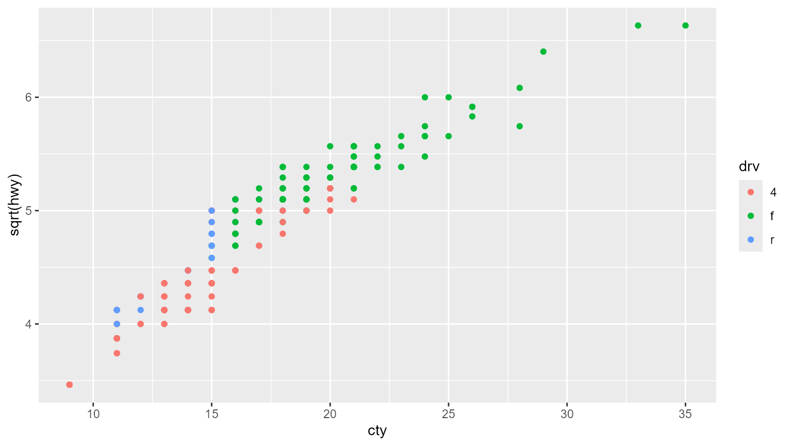

# Safer functionality

``` r
library(tinycodet)
#> Run `?tinycodet::tinycodet` to open the introduction help page of 'tinycodet'.
```

## Decimal (in)equality testing operators

This package adds the `%d==%, %d!=% %d<%, %d>%, %d<=%, %d>=%`
(in)equality operators, which perform safer decimal number truth
testing. They are virtually equivalent to the regular (in)equality
operators, `==, !=, <, >, <=, >=`, except for 2 aspects:

1.  The `%d...%` operators assume that if the absolute difference
    between any two numbers x and y is smaller than the Machine
    tolerance, sqrt(.Machine\$double.eps), then x and y should be
    consider to be equal. For example: `0.1*7 == 0.7` returns `FALSE`,
    even though they are equal, due to the way decimal numbers are
    stored in programming languages like ‘R’ and ‘Python’. But
    `0.1*7 %d==% 0.7` returns `TRUE`.

2.  Only numeric input is allowed, so characters are not coerced to
    numbers. I.e. `1 < "a"` gives `TRUE` , whereas `1 %d<% "a"` gives an
    error. For character equality testing, see %s==% from the ‘stringi’
    package.

Thus these provide safer decimal number (in)equality operators.

Some examples:

``` r
x <- c(0.3, 0.6, 0.7)
y <- c(0.1*3, 0.1*6, 0.1*7)
print(x); print(y)
#> [1] 0.3 0.6 0.7
#> [1] 0.3 0.6 0.7
x == y # gives FALSE, but should be TRUE
#> [1] FALSE FALSE FALSE
x!= y # gives TRUE, should be FALSE
#> [1] TRUE TRUE TRUE
x > y # not wrong
#> [1] FALSE FALSE FALSE
x < y # gives TRUE, should be FALSE
#> [1] TRUE TRUE TRUE
x %d==% y # here it's done correctly
#> [1] TRUE TRUE TRUE
x %d!=% y
#> [1] FALSE FALSE FALSE
x %d<% y # correct
#> [1] FALSE FALSE FALSE
x %d>% y # correct
#> [1] FALSE FALSE FALSE
x %d<=% y # correct
#> [1] TRUE TRUE TRUE
x %d>=% y # correct
#> [1] TRUE TRUE TRUE
```

 

There are also the `x %d{}% bnd` and `x %d!{}% bnd` operators, where
`bnd` is a vector of length 2, or a 2-column matrix
`(nrow(bnd)==length(x) or nrow(bnd)==1)`. The `x %d{}% bnd` operator
checks if `x` is within the **closed** interval with bounds defined by
`bnd`. The `x %d!{}% bnd` operator checks if `x` is outside the
**closed** interval with bounds defined by `bnd`.

Examples:

``` r

x <- c(0.3, 0.6, 0.7)
bnd <- cbind(x-0.1, x+0.1)
x %d{}% bnd
#> [1] TRUE TRUE TRUE
x %d!{}% bnd
#> [1] FALSE FALSE FALSE
```

 

## with_pro and aes_pro

‘tinycodet’ provides standard-evaluated versions of the common quoting
functions [`with()`](https://rdrr.io/r/base/with.html) and
[`ggplot2::aes()`](https://ggplot2.tidyverse.org/reference/aes.html):
[`with_pro()`](https://tony-aw.github.io/tinycodet/reference/pro.md) and
[`aes_pro()`](https://tony-aw.github.io/tinycodet/reference/pro.md),
respectively. See example below.

``` r

requireNamespace("ggplot2")
#> Loading required namespace: ggplot2
d <- import_data("ggplot2", "mpg")

# mutate data:
myform <- ~ displ + cyl + cty + hwy
d$mysum <- with_pro(d, myform)
summary(d)
#>     manufacturer       model         displ            year           cyl       
#>  Length   :234   Length   :234   Min.   :1.600   Min.   :1999   Min.   :4.000  
#>  N.unique : 15   N.unique : 38   1st Qu.:2.400   1st Qu.:1999   1st Qu.:4.000  
#>  N.blank  :  0   N.blank  :  0   Median :3.300   Median :2004   Median :6.000  
#>  Min.nchar:  4   Min.nchar:  2   Mean   :3.472   Mean   :2004   Mean   :5.889  
#>  Max.nchar: 10   Max.nchar: 22   3rd Qu.:4.600   3rd Qu.:2008   3rd Qu.:8.000  
#>                                  Max.   :7.000   Max.   :2008   Max.   :8.000  
#>        trans            drv           cty             hwy       
#>  Length   :234   Length   :234   Min.   : 9.00   Min.   :12.00  
#>  N.unique : 10   N.unique :  3   1st Qu.:14.00   1st Qu.:18.00  
#>  N.blank  :  0   N.blank  :  0   Median :17.00   Median :24.00  
#>  Min.nchar:  8   Min.nchar:  1   Mean   :16.86   Mean   :23.44  
#>  Max.nchar: 10   Max.nchar:  1   3rd Qu.:19.00   3rd Qu.:27.00  
#>                                  Max.   :35.00   Max.   :44.00  
#>          fl            class         mysum      
#>  Length   :234   Length   :234   Min.   :33.70  
#>  N.unique :  5   N.unique :  7   1st Qu.:43.10  
#>  N.blank  :  0   N.blank  :  0   Median :50.15  
#>  Min.nchar:  1   Min.nchar:  3   Mean   :49.66  
#>  Max.nchar:  1   Max.nchar: 10   3rd Qu.:54.08  
#>                                  Max.   :84.90

# plotting data:
x <- ~ cty
y <- ~ sqrt(hwy)
color <- ~ drv

ggplot2::ggplot(d, aes_pro(x, y, color = color)) +
  ggplot2::geom_point()
```



 

## Locked constants

One can re-assign the values `T` and `F`. One can even run something
like `T <- FALSE` and `F <- TRUE`! `tinycodet` adds the
[`lock_TF()`](https://tony-aw.github.io/tinycodet/reference/lock.md)
function that forces `T` to stay `TRUE` and `F` to stay `FALSE`.
Essentially, the
[`lock_TF()`](https://tony-aw.github.io/tinycodet/reference/lock.md)
function creates the locked constant `T` and `F`, assigned to `TRUE` and
`FALSE` respectively, to prevent the user from re-assigning them.
Removing the created `T` and `F` constants allows re-assignment again.

 

The `X %<-c% A` operator creates a `constant` `X` with assignment `A`.
Constants cannot be changed, only accessed or removed. So if you have a
piece of code that requires some unchangeable constant, use this
operator to create said constant.

 

## Safer Partial Matching

The
[`safer_partialmatch()`](https://tony-aw.github.io/tinycodet/reference/safer_partialmatch.md)
forces ‘R’ to give a warning when partial matching occurs when using the
dollar (\$) operator, or when other forms of partial matching occurs. It
simply calls the following:

``` r

options(
   warnPartialMatchDollar = TRUE,
   warnPartialMatchArgs = TRUE,
   warnPartialMatchAttr = TRUE
 )
```

 
