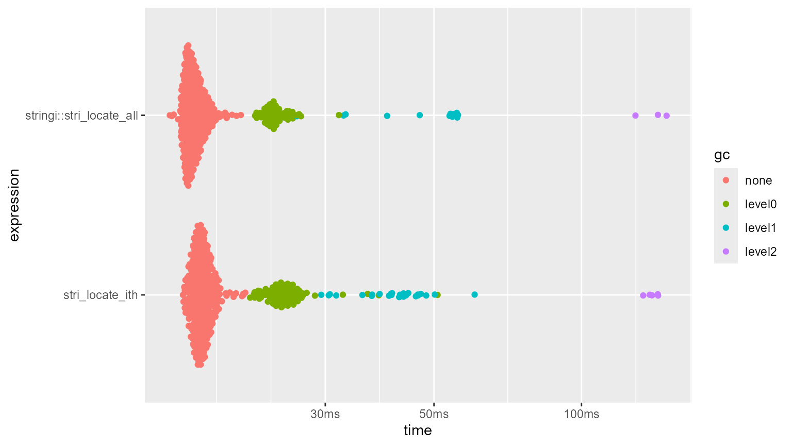
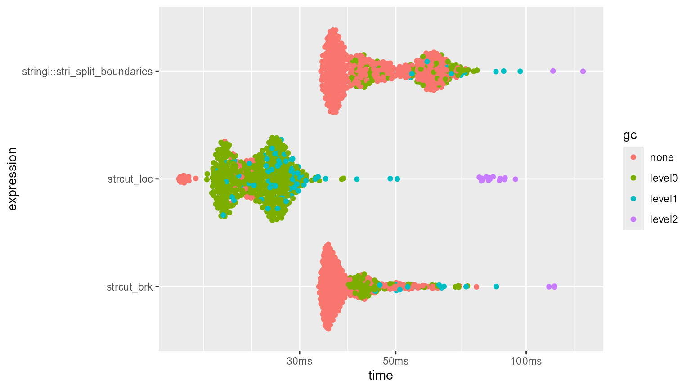
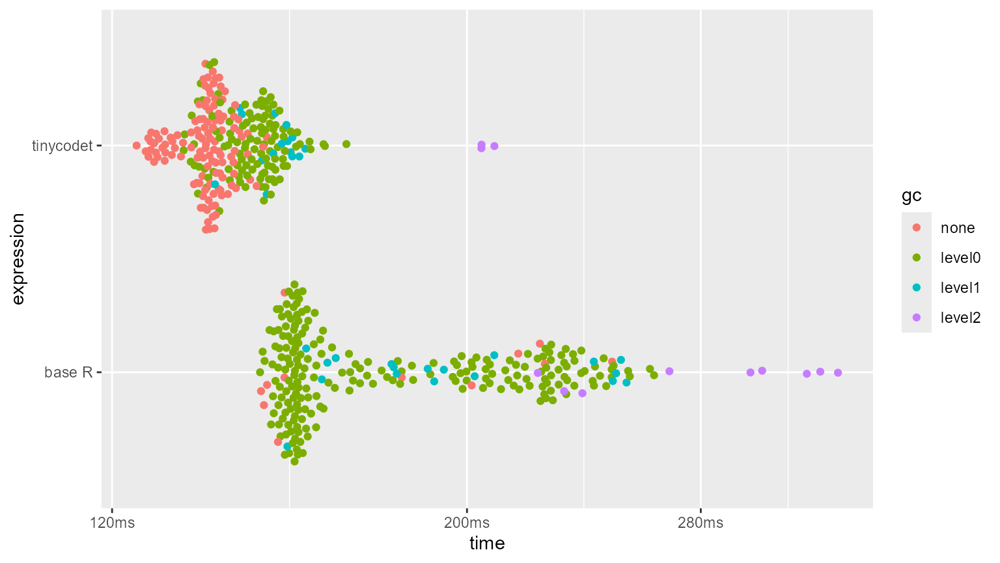
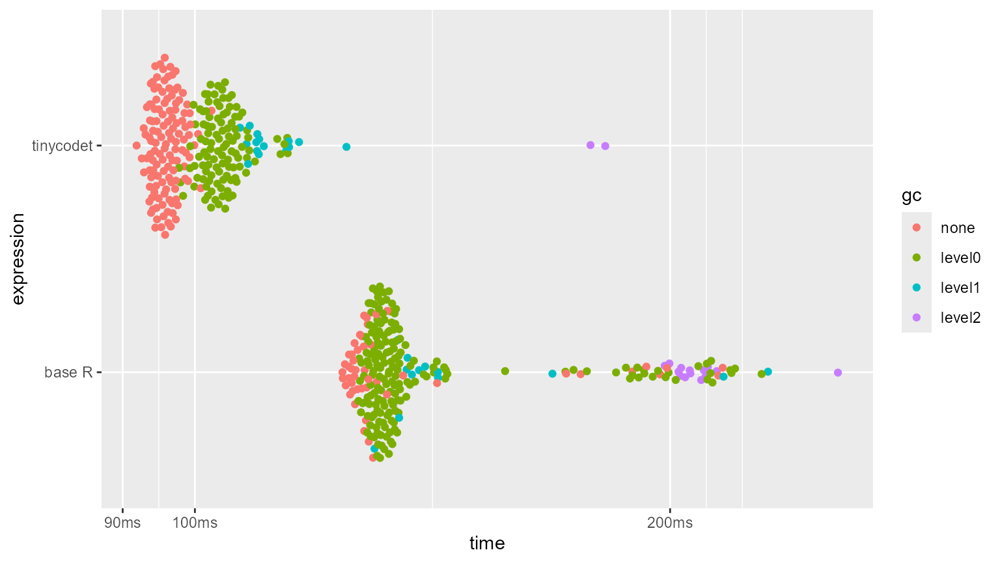

# Benchmarks

``` r
library(tinycodet)
#> Run `?tinycodet::tinycodet` to open the introduction help page of 'tinycodet'.
loadNamespace("bench")
#> <environment: namespace:bench>
loadNamespace("ggplot2")
#> <environment: namespace:ggplot2>
```

 

## Introduction

Some effort has been made to ensure the functions in ‘tinycodet’ are
well optimized. The string related functions, for example, are about in
the same order of magnitude in terms of speed as the `stringi` functions
they call.

Here some speed comparisons are given, using the ‘bench’ package.

 

## stri_locate_ith

[`stri_locate_ith()`](https://tony-aw.github.io/tinycodet/reference/stri_locate_ith.md)
has about the same performance as `stri_locate_all()`:

``` r
n <- 5e4
x <- rep(paste0(1:50, collapse = ""), n)
p <- "1"
i <- sample(c(-50:-1, 1:50), replace=TRUE, size = n)
bm.stri_locate_ith_vs_all <- bench::mark(
  "stri_locate_ith" = stri_locate_ith_fixed(x, p, i),
  "stringi::stri_locate_all" = stringi::stri_locate_all(x, fixed = p),
  min_iterations = 500,
  check = FALSE
)
summary(bm.stri_locate_ith_vs_all)
ggplot2::autoplot(bm.stri_locate_ith_vs_all)
```

    #> # A tibble: 2 × 6
    #>   expression                    min   median `itr/sec` mem_alloc `gc/sec`
    #>   <bch:expr>               <bch:tm> <bch:tm>     <dbl> <bch:byt>    <dbl>
    #> 1 stri_locate_ith            15.4ms   16.7ms      59.4     781KB     21.5
    #> 2 stringi::stri_locate_all   14.4ms   16.1ms      61.6     391KB     14.4



 

## strcut

The `strcut_` functions from ‘tinycodet’ have somewhat similar
performance as the boundary functions provided by ‘stringi’:

``` r
n <- 1e5
x <- rep("hello", n)
i <- sample(1:3, n, replace = TRUE)
loc <- stri_locate_ith(x, i=i, regex="a|e|i|o|u")
bm.strcut <- bench::mark(
  "strcut_loc" = { strcut_loc(x, loc) },
  "strcut_brk" = { strcut_brk(x, type = "", tolist = TRUE) },
  "stringi::stri_split_boundaries" = {
    stringi::stri_split_boundaries(x, type="character")
  },
  min_iterations = 500,
  check = FALSE
)
ggplot2::autoplot(bm.strcut)
```



 

## Row/columns-wise re-ordering

re-ordering rows/columns using the `%row~%` and `%col~%` operators
provided by ‘tinycodet’ is a faster than doing so using traditional
loops:

``` r
tempfun <- function(x, margin) {
  if(margin == 1) {
    for(i in 1:nrow(x)) x[i,] <- sort(x[i,])
    return(x)
  }
  if(margin == 2) {
    for(i in 1:ncol(x)) x[,i] <- sort(x[,i])
    return(x)
  }
}
```

``` r
mat <- matrix(sample(seq_len(n^2)), ncol = n)
bm.roworder <- bench::mark(
  tinycodet = mat %row~% mat,
  "base R" = tempfun(mat, 1),
  min_iterations = 250
)
ggplot2::autoplot(bm.roworder)
```



``` r
bm.colorder <- bench::mark(
  tinycodet = mat %col~% mat,
  "base R" = tempfun(mat, 2),
  min_iterations = 250
)
ggplot2::autoplot(bm.colorder)
```


